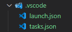

# VS Code setup guide for C# .NET development

## Required software

* Download [VS Code](https://code.visualstudio.com/download)

* Download [.NET SDK](https://dotnet.microsoft.com/en-us/download)

* Install **C#** extension by **Microsoft** (ID: ms-dotnettools.csharp)  

* (optional) Install **IntelliCode** extension by **Microsoft** (ID: VisualStudioExptTeam.vscodeintellicode)

* (optional) Install **vscode-icons** extension (ID: vscode-icons-team.vscode-icons)

* (optional) Install **GitLens** extension (ID: eamodio.gitlens)

* (optional) Install **NuGet Package Manager** extension (ID: jmrog.vscode-nuget-package-manager)

## Setup of a Console App

* Create a new **solution**

      dotnet new sln -n "SOLUTION_NAME"

* Create new **Console App project**

      dotnet new console -n "PROJECT_NAME"

* Create desired **library projects**

      dotnet new classlib -n "LIBRARY_NAME"

* Add each **project** to the **solution**

      dotnet sln SOLUTION_NAME.sln add ./PROJECT_NAME/PROJECT_NAME.csproj

* Add references betwen **projects** (if there are any)

      dotnet add PROJECT_NAME/PROJECT_NAME.csproj reference LIBRARY_NAME/LIBRARY_NAME.csproj

* Create **.gitignore** file to exclude output files

      dotnet new gitignore
  in case You already commited some of the files that are being excluded, before actually generating gitignore file, you should perform:

      git rm -rf --cached .
      git add .
  which will remove and read all of the files with respect to the **.gitignore** file. That means that this time files won't be tracked by git anymore. Some more detail can be found on [Stack Overflow issue](https://stackoverflow.com/questions/25436312/gitignore-not-working) regarding that matter.

* Generate assets for build and debug - **C# Extension** should automatically prompt You whether You want to generate them, but if it does not, You can generate them manually ussing **command pallette**.
  * open command pallette:  

         CTRL + SHIFT + P
  * look for:
  
        .NET Generate Assets for Build and Debug
  If an error occurs, especially one that says that **OmniSharp** is not running (and all attempts to restart it from **command pallette** fail), some previous version of **C# Extension** could be installed to solve it. But if that's not the case, or if You want to check different solutions, feel free to check out [Stack Overflow issue](https://stackoverflow.com/questions/62558818/unable-to-generate-assets-to-build-and-debug-omnisharp-server-is-not-running) related to that matter.
  > In case of succes, directory with files containing configuration is created

  

## Running the app

* To directly run the app, **cd** into the **Project** directory in **VS Code's** integrated terminal and use:

      dotnet run
  The project will run directly in the integrated terminal without any additional functionalities like debugger.

* Make use of the **Run and Debug Assets** generated previously, to benefit for example from debbugging capabilities.
  * Press  **F5** to run the default selected profile (since the right profile will be the first one, of two we generated, it will be selected by default)
  * Go to **Run and Debug** side menu and launch **.NET Core Launch (console)** profile - notice that it's name matches with the name stated in **launch.json** file that was generated previously.

## Adding NuGet Packages to the project

* While being in the **Project's directory**, use:

      dotnet add package PACKAGE_NAME
  to add the latest non-preview version of a package to the Project.

* Insert the reference manually
  * add entry into **.csproj** file between **ItemGroup** tags
  
      ```xml
      <ItemGroup>  
          <PackageReference Include="PACKAGE_NAME" Version="PACKAGE_VERSION" />  
      </ItemGroup>
      ```

  * perform

        dotnet restore

      to fetch referenced packages

* Use **NuGet Package Manager** extension

  * open command pallette:  

        CTRL + SHIFT + P
  * look for:

        NuGet Package Manager: Add Package
  * insert desired package name
  * choose the package version
  * select the **Project** You want to add the **NuGet** reference to

 ---

## References

* >[.NET CLI Docs](https://learn.microsoft.com/en-us/dotnet/core/tools/)  

* > [Microsoft C# with VS guide](https://learn.microsoft.com/en-us/shows/dotnet/get-started-vscode-csharp-net-core-windows)  

* >[T. Corey's C# with VS guide](https://www.youtube.com/watch?v=r5dtl9Uq9V0)
